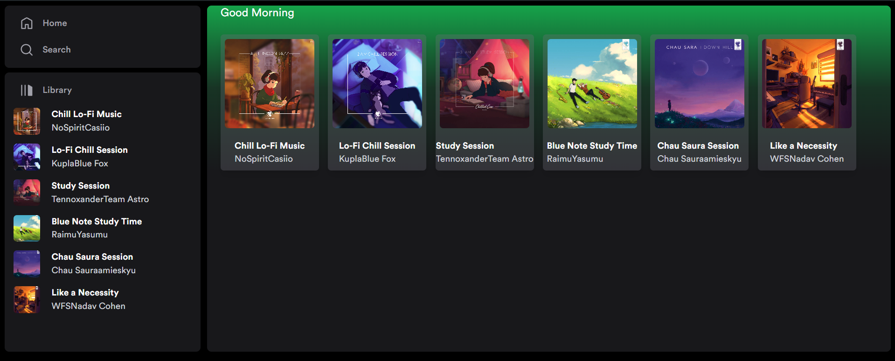

# App spotify

```text
/
├── public/
│   └── favicon.svg
├── src/
│   ├── components/
│   │   └── Card.astro
│   ├── layouts/
│   │   └── Layout.astro
│   └── pages/
│       └── index.astro
└── package.json
```



1. grid, para hacer grillas

2. Button Home Search

```
<div class="bg-zinc-900 rounded-lg p-2 flex-1">
    <ul>
      <SideMenuItem href="/">
        <LibraryIcon />
        Library
      </SideMenuItem>
    </ul>
  </div>
```

3. degradado
```
<div
			class="absolute inset-0 bg-gradient-to-t from-zinc-900 via-zinc-900/80"
		>
</div>
```    

4. transition name click cover id select
```
      transition:name=`playlist ${id} image`
``` 

5, transition more animation 
>- name for default copy
```
 transition:name=`playlist ${id} box`
```
>- in button or cover
```
<a
  href={`/playlist/${id}`}
  class="playlist-item transition-all duration-300 flex relative p-2 overflow-hidden gap-2 pb-4 rounded-md hover:bg-zinc-800 shadow-lg hover:shadow-xl bg-zinc-500/30 w-44 flex-col"
  transition:name=`playlist ${id} box`
>
```
>- import in layout 
```
import { ViewTransitions } from "astro:transitions";

<ViewTransitions fallback="none" />
```
>- add id similar in all is unico
```
    <header class="flex flex-col gap-8 px-6">
      <picture class="aspect-square w-52 h-52 flex-none">
        
      </picture>
    </header>
```